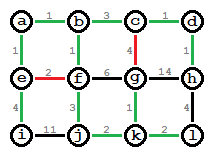

# Kruskal's Algorithm

__Needed ADT's__
- **Union-Find**: Used for building of the minimum tree
- **Sorted List**: Used to store the edge lengths of the initial graph (u, v, weight)
- **Weighted Graph**: Used to create the graph of weighted node connections Kruskal's algorithm will execute on
- **Array Set**: Used to keep track of the nodes within the weighted graph

## Project Requirements
* Code and implementation
	* The ADT's
	* The algorithm
	* The interview question (Removing redudnant edge from minimum tree)
* Slide deck
	* Review problem
		* Finding the newest MST after and edge is added to an existing valid MST, i.e. Does the new edge change the tree edges?
	* What companies ask it
		* Can be asked at Amazon, financial companies, and others that work with logistics networks.
	* Where the question was found
		* Seen on Glassdoor as a question that had been asked.
	* What is the underlying ADT / algorithm 
		* A Weighted Graph alongside a Union-Find which internally utilize Lists, Sets, Maps and more.
* Presentation
	* Both students on a 10 minute presenation 

* Something I want to note is Prim's algorithm and how it's better in more dense graphs while Kruskals performs better in sparse graphs